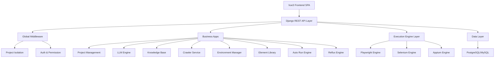
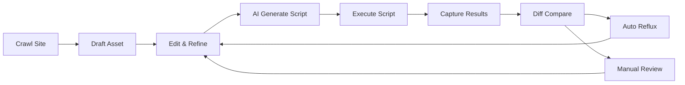

# UI自动化智能知识库平台

Feature Name: ui-automation-knowledge-platform
Updated: 2026-07-02

## Description

企业级低代码UI自动化自愈测试平台，基于Python Django + Vue3前后端分离架构。打通「站点资产自动爬取 → 零代码自然语言用例 → LLM智能生成自动化脚本 → 在线引擎执行 → 执行数据回流迭代资产」完整闭环。

## Architecture

### 系统架构总览



### 数据流闭环



## Components and Interfaces

### Frontend (Vue3)

| Component | Path | Description |
|-----------|------|-------------|
| Dashboard | views/dashboard/index.vue | 全局工作台数据看板 |
| ProjectList | views/project/list.vue | 项目列表管理 |
| ProjectConfig | views/project/config.vue | 项目详情配置 |
| LLMSetting | views/llm/setting.vue | LLM模型配置 |
| LLMPrompt | views/llm/prompt.vue | Prompt模板配置 |
| LLMTest | views/llm/test.vue | AI脚本生成测试面板 |
| LLMLog | views/llm/log.vue | AI调用日志 |
| KnowledgeList | views/knowledge/list.vue | 资产列表 |
| KnowledgeEdit | views/knowledge/edit.vue | 资产编辑核心页 |
| VersionDiff | views/knowledge/versionDiff.vue | 版本/回流对比 |
| CrawlerTaskList | views/crawler/taskList.vue | 爬取任务列表 |
| CrawlerTaskDetail | views/crawler/taskDetail.vue | 爬取详情日志 |
| EnvList | views/env/envList.vue | 环境管理 |
| Credential | views/env/credential.vue | 凭据管理 |
| ElementList | views/elementLib/list.vue | 元素库列表维护 |
| RunRecord | views/autoRun/record.vue | 执行记录 |
| BatchTask | views/autoRun/batchTask.vue | 批量任务 |
| RefluxCenter | views/reflux/center.vue | 回流审核中心 |
| SystemUser | views/system/user.vue | 用户管理 |
| SystemRole | views/system/role.vue | 角色管理 |
| SystemSetting | views/system/setting.vue | 系统设置 |

### Backend Django Apps

| App | Purpose | Core Files |
|-----|---------|------------|
| project | 项目管理 | models, serializers, views, service, urls |
| llm_engine | LLM大模型AI核心 | models, serializers, client, service, views, urls |
| knowledge | 知识库资产 | models, serializers, service, views, urls |
| crawler | 站点爬取 | models, service, views, urls |
| environment | 环境凭据 | models, serializers, views, urls |
| element_lib | 公共元素库 | models, serializers, views, urls |
| auto_run | 自动化执行 | models, service, views, urls |
| reflux | 资产回流自愈 | models, service, views, urls |
| system | 系统权限 | models, serializers, views, urls |

### Core Shared Modules

| Module | Purpose |
|--------|---------|
| core/response.py | 统一API返回结构体 |
| core/exception.py | 全局异常捕获处理 |
| core/middleware.py | 项目隔离与权限校验中间件 |
| core/security.py | AES加密与数据脱敏 |
| core/logger.py | 全局日志配置 |
| engine/engine_base.py | 执行引擎抽象基类 |
| engine/engine_factory.py | 引擎工厂（按类型创建引擎实例） |
| service/nlp_parse.py | 规则NLP步骤解析 |
| service/script_build.py | Python脚本组装构建 |
| service/diff_compare.py | 代码/文本差异比对 |
| service/task_scheduler.py | 异步任务调度器 |

## Data Models

### Core Tables

```
sys_project
  id, project_name, project_code, description, status
  default_env_id, create_user, create_time, update_time

llm_global_config
  id, project_id, model_type, model_name, api_base
  api_key(encrypted), timeout, temperature, max_tokens
  is_enable, is_default, create_time, update_time

llm_prompt_template
  id, project_id, template_name, template_type
  template_content, is_default, is_enable, sort, create_time

llm_generate_log
  id, project_id, asset_id, template_type
  input_content, output_script, cost_time, status, error_msg, create_time

kb_category
  id, project_id, parent_id, name, level, sort, create_time

kb_asset
  id, project_id, category_id, asset_name, priority, terminal_type
  status, pre_condition, post_condition, crawler_url, env_type
  crawler_rule, engine_type, run_param, assert_config
  version, create_user, update_user, create_time, update_time

kb_asset_step
  id, asset_id, sort_num, step_content
  element_name, action_type, param, assert_text, is_valid, create_time

kb_asset_script
  id, asset_id, engine_type, script_content, script_version, is_last, create_time

kb_crawler_task
  id, project_id, task_name, url, env_id, credential_id
  crawler_scope, filter_rule, status, result_msg
  element_count, step_count, auto_asset_id
  start_time, end_time, create_user

kb_env
  id, project_id, env_name, env_type, base_url, status

kb_credential
  id, env_id, title, account, password(encrypted), cookie(encrypted), token(encrypted), is_enable

kb_element
  id, project_id, page_name, element_name, element_type
  locator_type, locator_value, status, last_refresh_time

kb_run_record
  id, project_id, asset_id, script_version, run_type
  result, cost_time, screenshot_path, video_path
  log_content, fail_reason, llm_model_used, run_time

kb_reflux_record
  id, project_id, asset_id, run_record_id, reflux_type
  diff_content(JSON), new_script, new_element_data, new_step_data
  status, audit_user, audit_time, create_time

kb_asset_version
  id, asset_id, version_num, version_content(JSON), version_type, create_time
```

## API Endpoints

### Project Management
```
GET    /api/project/list          - 项目列表
POST   /api/project/save          - 新增/编辑项目
POST   /api/project/set-default   - 设置默认项目
POST   /api/project/permission/save - 项目权限配置
```

### LLM Configuration
```
POST   /api/llm/config/save       - 保存模型配置
POST   /api/llm/config/test       - 模型连通性测试
GET    /api/llm/template/list     - 模板列表
POST   /api/llm/template/save     - 保存模板
POST   /api/llm/generate/script   - AI生成Python脚本
GET    /api/llm/log/list          - AI调用日志
```

### Crawler
```
POST   /api/crawler/test-connect  - 测试站点连通性
POST   /api/crawler/start         - 启动爬取任务
GET    /api/crawler/progress      - 获取实时进度
POST   /api/crawler/result/save   - 爬取结果生成资产
```

### Knowledge Base
```
GET    /api/knowledge/list        - 资产列表
POST   /api/knowledge/save        - 保存资产
GET    /api/knowledge/detail/:id  - 资产详情
POST   /api/knowledge/batch       - 批量操作
POST   /api/knowledge/version/diff - 版本差异对比
```

### Environment & Credentials
```
GET    /api/env/list              - 环境列表
POST   /api/env/save              - 保存环境
GET    /api/credential/list       - 凭据列表
POST   /api/credential/save       - 保存凭据
```

### Element Library
```
GET    /api/element/list          - 元素列表
POST   /api/element/save          - 保存元素
POST   /api/element/repair        - AI修复元素定位
GET    /api/element/related-cases - 关联用例查询
```

### Auto Run
```
POST   /api/run/execute           - 单条执行
POST   /api/run/batch             - 批量执行
GET    /api/run/record/list       - 执行记录列表
GET    /api/run/record/detail/:id - 执行详情
POST   /api/run/schedule/save     - 保存定时任务
```

### Reflux
```
GET    /api/reflux/list           - 回流记录列表
GET    /api/reflux/detail/:id     - 回流详情（含差异对比）
POST   /api/reflux/audit          - 审核回流记录
POST   /api/reflux/rollback/:id   - 版本回滚
```

### System
```
GET    /api/system/user/list      - 用户列表
POST   /api/system/user/save      - 保存用户
GET    /api/system/role/list      - 角色列表
POST   /api/system/role/save      - 保存角色
GET    /api/system/setting/get    - 获取系统配置
POST   /api/system/setting/save   - 保存系统配置
GET    /api/system/log/list       - 操作日志
```

## Correctness Properties

- **Project Isolation**: Every database query must include project_id filtering via middleware injection
- **Credential Security**: All sensitive fields (api_key, password, cookie, token) must be AES-256 encrypted at rest
- **Version Integrity**: Every asset modification must create an immutable version record
- **Idempotent Crawl**: Same URL + same filter rules should not create duplicate assets
- **Script Validity**: Generated scripts must pass Python syntax check before being saved
- **Reflux Audit Trail**: Every reflux operation must be logged with audit user and timestamp

## Error Handling

| Scenario | Handling Strategy |
|----------|-------------------|
| LLM API timeout | Retry up to 2 times with exponential backoff; fall back to NLP-only generation |
| Crawler page load failure | Retry once; capture screenshot; mark task as failed with error details |
| Script execution failure | Capture screenshot, recording, stack trace; trigger reflux for element repair |
| Invalid credential | Block execution; notify user to update credential via frontend notification |
| Cross-project data access | Reject request with 403; log security event |
| Concurrent asset modification | Optimistic locking using version field; reject stale updates with 409 |

## Test Strategy

- **Unit Tests**: Django model tests for all apps, service function tests with mocked LLM responses
- **Integration Tests**: API endpoint tests with Django test client, middleware isolation verification
- **E2E Tests**: Playwright-based end-to-end tests for critical user flows (login → create project → crawl → generate script → execute → reflux)
- **Security Tests**: Credential encryption verification, cross-project data isolation verification

## References

- Original requirements document: `.monkeycode/specs/ui-automation-knowledge-platform/original-requirements.md`
